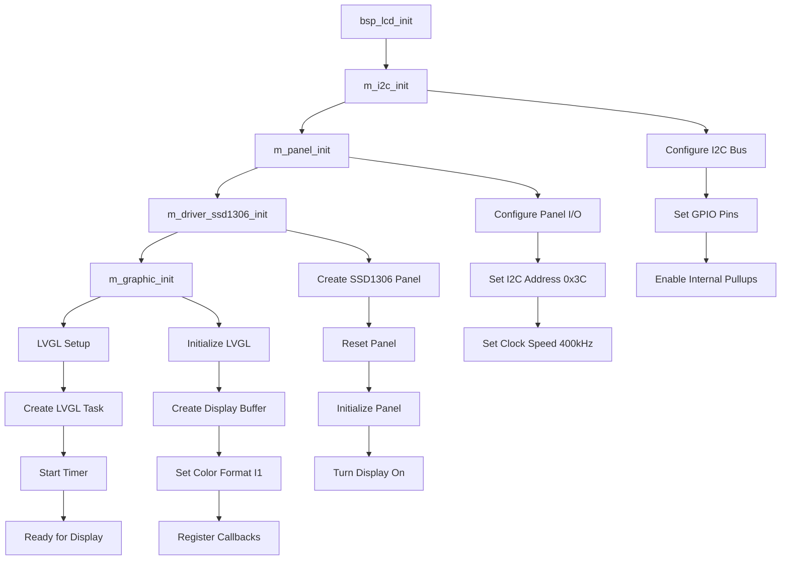
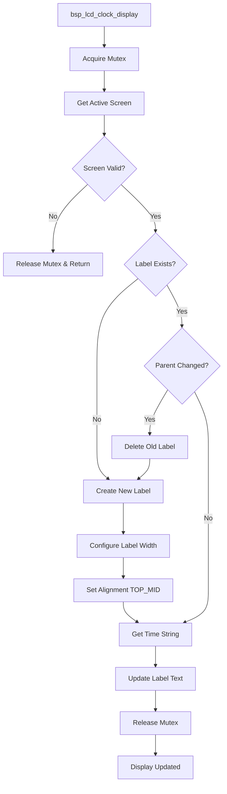
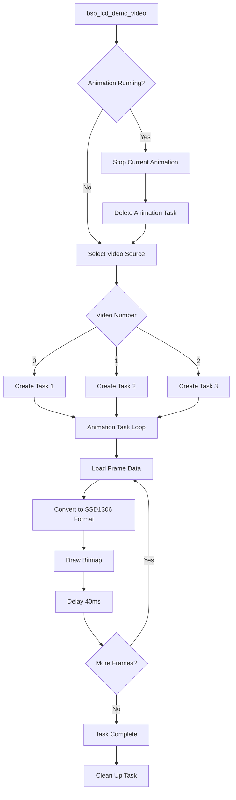
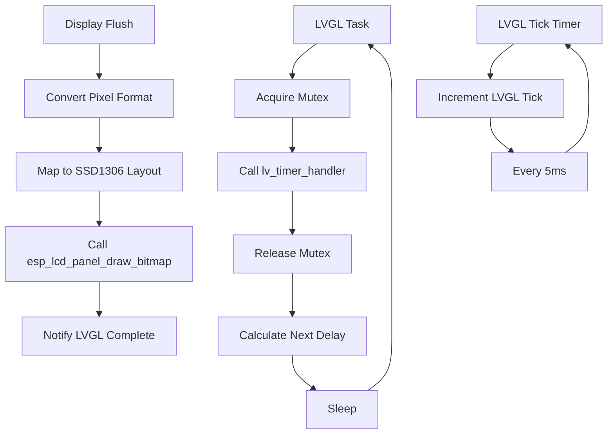
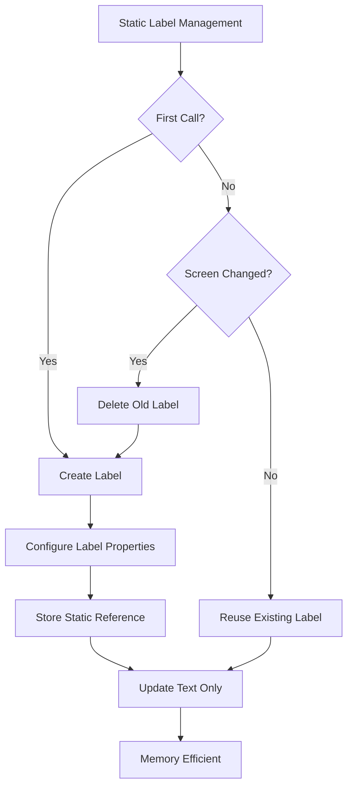

# BSP LCD Module Documentation

## Overview

The BSP LCD module provides a comprehensive Board Support Package for LCD display functionality in the NeoWatch project. It integrates SSD1306 OLED display with LVGL graphics library to provide clock display and animation capabilities.

## Table of Contents

1. [Architecture Overview](#architecture-overview)
2. [Hardware Configuration](#hardware-configuration)
3. [Software Components](#software-components)
4. [API Reference](#api-reference)
5. [Workflow Diagrams](#workflow-diagrams)
6. [Usage Examples](#usage-examples)
7. [Troubleshooting](#troubleshooting)

## Architecture Overview

The BSP LCD module consists of several interconnected layers:

```
┌─────────────────────────────────────────────────┐
│                Application Layer                │
├─────────────────────────────────────────────────┤
│           BSP LCD Interface (bsp_lcd.h)         │
├─────────────────────────────────────────────────┤
│              LVGL Graphics Layer                │
├─────────────────────────────────────────────────┤
│            ESP LCD Panel Interface              │
├─────────────────────────────────────────────────┤
│               I2C Master Driver                 │
├─────────────────────────────────────────────────┤
│              Hardware (SSD1306)                 │
└─────────────────────────────────────────────────┘
```

## Hardware Configuration

### SSD1306 OLED Display
- **Resolution**: 128x64 pixels
- **Interface**: I2C
- **Address**: 0x3C (7-bit addressing)
- **Clock Speed**: 400 kHz

### Pin Configuration
```c
#define I2C_BUS_PORT     0      // I2C bus number
#define PIN_NUM_SDA      22     // GPIO 22 - I2C Data line
#define PIN_NUM_SCL      21     // GPIO 21 - I2C Clock line
#define PIN_NUM_RST      -1     // No reset pin used
```

## Software Components

### Core Components

1. **I2C Master Driver**: Handles low-level I2C communication
2. **ESP LCD Panel Interface**: Provides abstraction for display operations
3. **SSD1306 Driver**: Specific driver for SSD1306 OLED controller
4. **LVGL Integration**: Graphics library for UI elements
5. **Animation Engine**: Handles video frame playback

### Key Features

- Thread-safe LVGL operations with mutex protection
- Static label management for clock display
- Multiple animation playback support
- Automatic screen buffer management
- Real-time clock display integration

## API Reference

### Initialization Functions

#### `base_status_t bsp_lcd_init(void)`
Initializes the entire LCD subsystem including I2C, panel driver, and LVGL.

**Returns:**
- `BS_OK`: Initialization successful
- `BS_ERROR`: Initialization failed

**Workflow:**
1. Initialize I2C master bus
2. Setup LCD panel I/O
3. Initialize SSD1306 driver
4. Configure LVGL graphics system
5. Start LVGL task

### Display Functions

#### `void bsp_lcd_clock_display(uint16_t year, uint8_t month, uint16_t day, uint8_t hour, uint8_t min, uint8_t sec)`
Displays clock information on the OLED screen using LVGL labels.

**Parameters:**
- `year`: Year value (e.g., 2025)
- `month`: Month (1-12)
- `day`: Day of month (1-31)
- `hour`: Hour (0-23)
- `min`: Minutes (0-59)
- `sec`: Seconds (0-59)

**Features:**
- Reuses static label to prevent memory leaks
- Thread-safe with mutex protection
- Automatic screen change detection
- Real-time formatting from RTC

#### `void bsp_lcd_demo_video(uint8_t video_num)`
Plays animation sequences on the display.

**Parameters:**
- `video_num`: Animation index (0-2)
  - 0: "Throw Computer" animation (60 frames)
  - 1: "Em Chua 18" animation (60 frames)
  - 2: "Meme Cuoi" animation (60 frames)

**Features:**
- Automatic task management
- Frame rate control (25 FPS)
- Previous animation cleanup
- Non-blocking execution

#### `base_status_t bsp_lcd_clock_set_mode(bsp_lcd_clock_t mode)`
Sets the clock display mode (currently placeholder).

**Parameters:**
- `mode`: Clock display mode
  - `BSP_LCD_CLOCK_TYPE_LEFT`
  - `BSP_LCD_CLOCK_TYPE_RIGHT`

## Workflow Diagrams

### 1. Initialization Workflow



### 2. Clock Display Workflow



### 3. Animation Playback Workflow



### 4. LVGL Integration Workflow



### 5. Memory Management Workflow



## Usage Examples

### Basic Initialization

```c
#include "bsp_lcd.h"

void app_main(void) {
    // Initialize the LCD subsystem
    if (bsp_lcd_init() == BS_OK) {
        ESP_LOGI("APP", "LCD initialized successfully");
    } else {
        ESP_LOGE("APP", "LCD initialization failed");
        return;
    }
    
    // Now you can use display functions
}
```

### Clock Display Integration

```c
#include "bsp_lcd.h"
#include "bsp_rtc.h"

void display_current_time(void) {
    // Get current time from RTC
    struct tm timeinfo;
    if (bsp_rtc_get_time(&timeinfo) == BS_OK) {
        // Display on LCD
        bsp_lcd_clock_display(
            timeinfo.tm_year + 1900,  // Year
            timeinfo.tm_mon + 1,      // Month (0-11 -> 1-12)
            timeinfo.tm_mday,         // Day
            timeinfo.tm_hour,         // Hour
            timeinfo.tm_min,          // Minute
            timeinfo.tm_sec           // Second
        );
    }
}

// Task function for continuous clock display
void clock_display_task(void *pvParameters) {
    while (1) {
        display_current_time();
        vTaskDelay(pdMS_TO_TICKS(1000)); // Update every second
    }
}
```

### Animation Playback

```c
#include "bsp_lcd.h"

void play_animation_sequence(void) {
    // Play first animation
    bsp_lcd_demo_video(0);
    
    // Wait for completion (or implement callback)
    vTaskDelay(pdMS_TO_TICKS(3000)); // 60 frames * 40ms + buffer
    
    // Play second animation
    bsp_lcd_demo_video(1);
}
```

### Integration with System Display

```c
#include "system_display.h"

void system_display_init(void) {
    bsp_lcd_init();
    bsp_rtc_init();
}

void system_display_clock(void) {
    static int64_t tick_start = 0;
    int64_t now = esp_timer_get_time();

    if ((now - tick_start) > 1000000) { // 1 second
        tick_start = now;
        
        // Get time and display
        bsp_lcd_clock_display(2025, 9, 28, 14, 30, 45);
    }
    
    vTaskDelay(1); // Yield to other tasks
}
```

## Performance Characteristics

### Memory Usage
- **LVGL Draw Buffer**: ~1KB (128×64÷8 + palette)
- **Animation Frames**: ~1KB per frame (pre-converted)
- **Static Variables**: Minimal (<100 bytes)
- **Stack Usage**: 2-4KB per task

### Timing Specifications
- **I2C Clock**: 400 kHz
- **Frame Rate**: 25 FPS (40ms per frame)
- **LVGL Tick**: 5ms resolution
- **Display Update**: <10ms typical

### Thread Safety
- Mutex protection for all LVGL operations
- Safe concurrent access from multiple tasks
- Animation task management with proper cleanup

## Troubleshooting

### Common Issues

1. **Display Not Working**
   - Check I2C connections (GPIO 21, 22)
   - Verify I2C address (0x3C)
   - Ensure power supply is adequate

2. **Animation Stuttering**
   - Check FreeRTOS heap memory
   - Verify task priorities
   - Monitor I2C bus timing

3. **Memory Leaks**
   - Static label implementation prevents LVGL object leaks
   - Animation tasks self-cleanup after completion
   - LVGL buffers are managed automatically

4. **Task Watchdog Timeouts**
   - All long-running operations include task yields
   - Mutex operations have timeout protection
   - Animation tasks are properly scheduled

### Debug Tips

```c
// Enable detailed logging
#define LOG_LOCAL_LEVEL ESP_LOG_DEBUG

// Monitor LVGL memory usage
ESP_LOGI("LVGL", "Memory used: %d bytes", lv_mem_get_used_pct());

// Check I2C communication
ESP_LOGI("I2C", "Bus state: %s", i2c_bus ? "OK" : "FAILED");
```

## Future Enhancements

1. **Dynamic Resolution Support**: Support multiple display sizes
2. **Color Display**: Extend for color OLED displays
3. **Touch Integration**: Add touch panel support
4. **Power Management**: Implement display sleep modes
5. **Custom Animations**: Runtime animation loading
6. **Multi-language**: Text rendering for different languages

## Dependencies

- ESP-IDF v5.5+
- LVGL v9.x
- FreeRTOS
- ESP LCD Panel drivers
- I2C Master driver

## Version History

- **v1.0.0** (2025-09-28): Initial implementation with SSD1306 support
  - Basic clock display
  - Animation playback
  - LVGL integration
  - Thread-safe operations

---

*This documentation covers the BSP LCD module for the NeoWatch project. For additional information, refer to the source code comments and ESP-IDF documentation.*