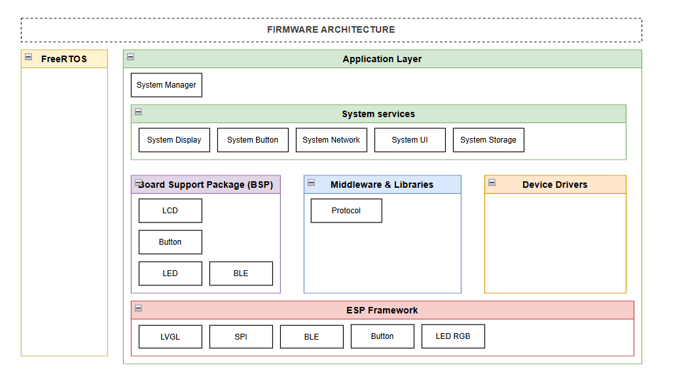
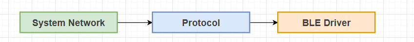
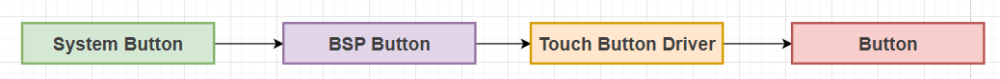

# NeoWatch Architecture Document

## Architecture Overview

## Software Layered Architecture

## Device States

## Data Flow

### System Manager

### System Display

### System Network

### System UI

### System Button

### System Settings

