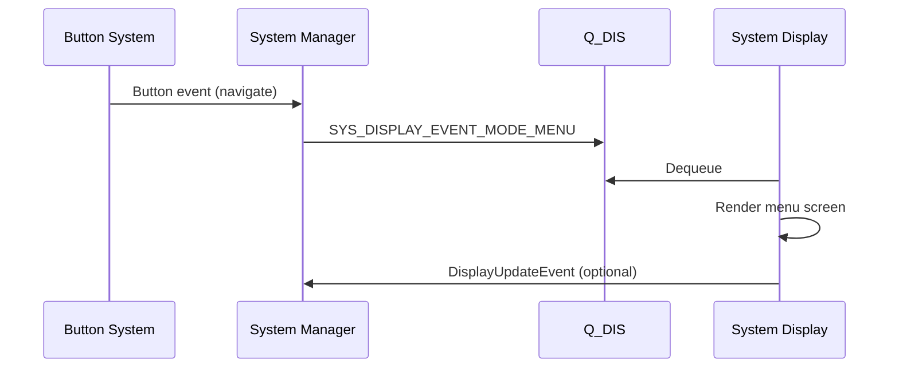

# System Display Detailed Design Document

## 1. Purpose

System Display is responsible for rendering watch UI states and visual feedback.

In the System Manager architecture, System Display is a queue consumer on Q_DIS and an optional event publisher back to System Manager for completion/error reporting.

---

## 2. Role in System Manager Architecture

Based on the System Manager SDD:

1. System Manager receives events from Button, UI, Network, and Settings.
2. System Manager routes display-related commands to Q_DIS.
3. System Display dequeues commands and applies rendering updates.
4. System Display may publish response events such as update done or render error.

This keeps display logic isolated from business logic and preserves async processing.

---

## 3. Display Event Enum

The following enum is recommended for app-level display commands carried in Q_DIS:

```c
typedef enum
{
  SYS_DISPLAY_EVENT_MODE_BOOT = 0,
  SYS_DISPLAY_EVENT_MODE_STANDBY,
  SYS_DISPLAY_EVENT_MODE_MENU,
  SYS_DISPLAY_EVENT_MODE_SETTING,

  SYS_DISPLAY_EVENT_REFRESH,
  SYS_DISPLAY_EVENT_BRIGHTNESS_SET,
  SYS_DISPLAY_EVENT_SLEEP,
  SYS_DISPLAY_EVENT_WAKE,

  SYS_DISPLAY_EVENT_NOTIFICATION_SHOW,
  SYS_DISPLAY_EVENT_STATUS_ICON_UPDATE,

  SYS_DISPLAY_EVENT_ERROR_OVERLAY,

  SYS_DISPLAY_EVENT_MAX
} system_display_event_t;
```

Notes:

- The first 4 events complete your current System Mode Update requirement.
- The remaining events are recommended for practical watch behavior.

---

## 4. Required Events (Current Scope)

### 4.1 System Mode Update

System Mode Update is implemented through mode-specific events:

- SYS_DISPLAY_EVENT_MODE_BOOT
- SYS_DISPLAY_EVENT_MODE_STANDBY
- SYS_DISPLAY_EVENT_MODE_MENU
- SYS_DISPLAY_EVENT_MODE_SETTING

Expected behavior:

1. Clear or transition from previous screen.
2. Load the target view layout.
3. Trigger an immediate display refresh.

---

## 5. Recommended Additional Events

### 5.1 Refresh and Power

- SYS_DISPLAY_EVENT_REFRESH
- SYS_DISPLAY_EVENT_SLEEP
- SYS_DISPLAY_EVENT_WAKE

Reason:

- Needed for deterministic redraw control and display power saving.

### 5.2 Brightness

- SYS_DISPLAY_EVENT_BRIGHTNESS_SET

Reason:

- Aligns with Settings subsystem (brightness already exists in settings data).

### 5.3 Notifications and Status

- SYS_DISPLAY_EVENT_NOTIFICATION_SHOW
- SYS_DISPLAY_EVENT_STATUS_ICON_UPDATE

Reason:

- UI and Network can request visual status updates without direct display coupling.

### 5.4 Error UX

- SYS_DISPLAY_EVENT_ERROR_OVERLAY

Reason:

- Standard way to render recoverable errors (for example BLE sync fail, storage issue).

---

## 6. Message Contract for Q_DIS

```c
typedef struct
{
  system_display_event_t event;
  uint32_t timestamp_ms;
  uint8_t brightness;     // used by BRIGHTNESS_SET
  uint8_t mode;           // optional mode metadata
  uint16_t payload_id;    // notification/status/error id
} system_display_msg_t;
```

Guidelines:

1. Keep message fixed-size for RTOS determinism.
2. Do not put large UI payloads directly in queue messages.
3. Pass IDs/handles and let display layer resolve resources locally.

---

## 7. Event Flow Example



---

## 8. Processing Rules

1. Process Q_DIS in FIFO order.
2. Coalesce repeated refresh events when queue pressure is high.
3. Brightness updates should overwrite stale brightness requests.
4. Sleep event has priority over refresh when battery/power policy requires.
5. Rendering must be non-blocking to higher-priority RTOS tasks.

---

## 9. Minimal Verification Checklist

1. Mode events switch to correct view: boot, standby, menu, setting.
2. Brightness event applies and persists expected level.
3. Sleep and wake events correctly control display power state.
4. Notification and status icon events render expected overlays/icons.
5. Queue stress test does not deadlock display task.