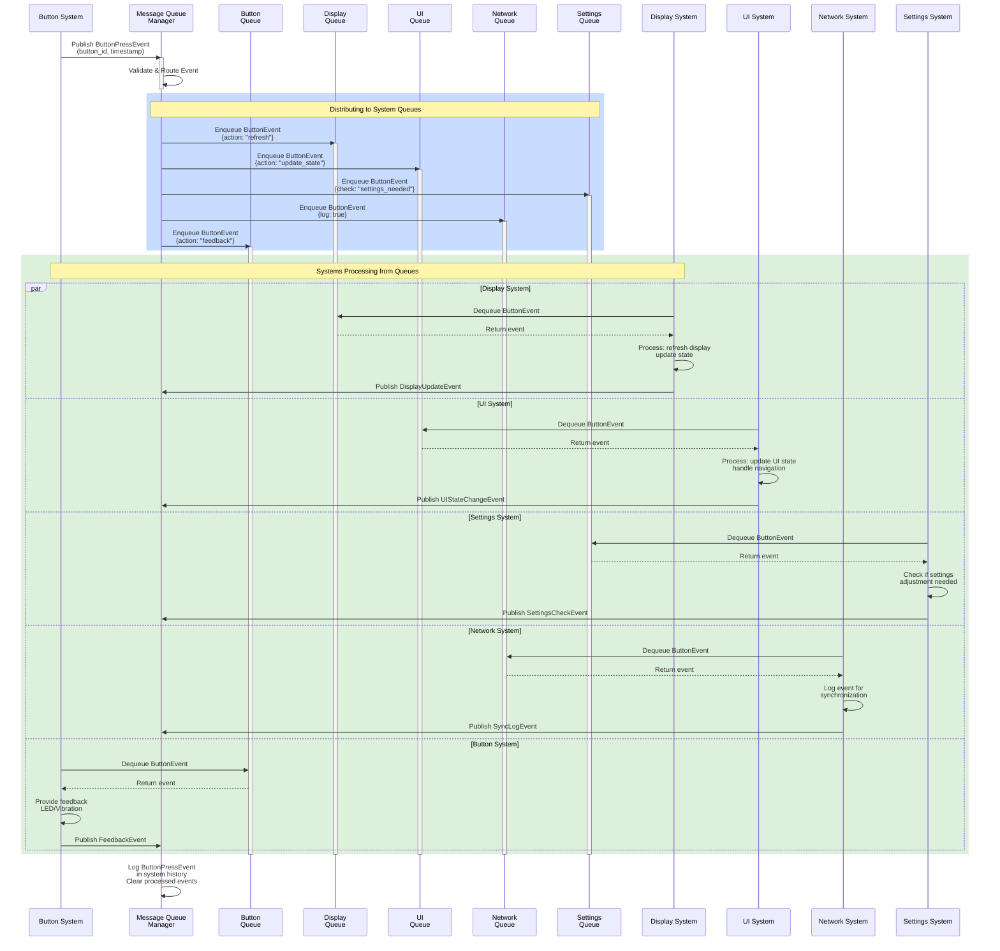
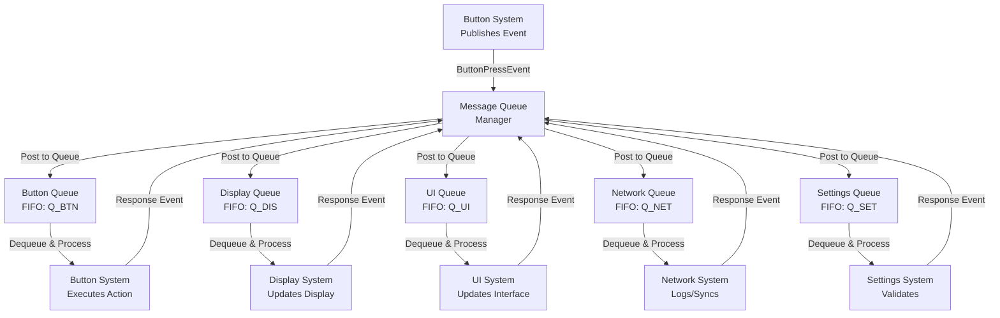

# System Manager Detailed Design Document

## Overview

The System Manager is responsible for managing the overall system operations, including coordinating between different components, handling system events, and ensuring smooth functioning of the entire system. It acts as a central hub that oversees the interactions between various subsystems and ensures that they work together seamlessly.

## Concept: Message Queue-Based Event Management

### Purpose

The System Manager implements an event-driven architecture using message queues to decouple interactions between different system layers and components. This approach provides a flexible, scalable, and maintainable solution for inter-system communication.

### Key Principles

#### 1. **Decoupled Architecture**

- Different system layers (UI, Network, Display, Settings, Button) communicate through message queues rather than direct function calls
- Components do not need to know about each other's internal implementation
- Reduces tight coupling and facilitates independent development and testing

#### 2. **Event-Driven Communication**

- All system interactions are represented as discrete events/messages
- Each event contains relevant data needed for processing
- Events are published to queues and consumed by interested subscribers

#### 3. **Asynchronous Processing**

- Messages are queued and processed in order
- Prevents blocking operations between components
- Improves system responsiveness and overall performance

### Architecture Components

#### Message Queue Manager

- Central component that manages all message queues
- Handles message routing based on event type
- Maintains queue priorities if needed

#### Event Publishers

- System layers that generate events (Button input, Network data, Settings changes)
- Publish events to the relevant message queues
- Do not wait for processing results

#### Event Subscribers/Consumers

- System components that listen to and process events
- React to specific event types
- Execute appropriate actions based on event data

### Message Types

```
UI Events:
├── Button Press Events
├── Touch Events
├── Display Interaction Events
└── Settings Update Events

Network Events:
├── Data Received Events
├── Connection Status Events
├── Sync Events
└── Error Events

System Events:
├── Power State Changes
├── Mode Changes
├── Configuration Updates
└── System Health Events
```

### Benefits

1. **Scalability**: Easy to add new components or event types without modifying existing code
2. **Maintainability**: Clear separation of concerns and reduced code dependencies
3. **Testability**: Components can be tested in isolation with mock message queues
4. **Reliability**: Events can be logged and replayed for debugging
5. **Flexibility**: Events can be processed synchronously or asynchronously as needed
6. **Priority Handling**: Different event types can be assigned different priority levels

### Implementation Considerations

- Queue depth management to prevent memory overflow
- Event timeout mechanisms for unprocessed messages
- Error handling and recovery for failed event processing
- Logging and monitoring of message flow
- Performance optimization for high-frequency events

## Sequence Diagram

### Example: Button Press Event Flow with System Queues



### Queue Interaction Pattern



### Event Flow Timeline

```
Time | Button        | MQM               | Display         | UI              | Network
-----|---------------|-------------------|-----------------|-----------------|----------
T0   | Detect Press  |                   |                 |                 |
T1   | Publish Event | ✓ Receive         | ✓ Queue         | ✓ Queue         |
T2   |               | Route to all      |                 |                 |
T3   |               |                   | Process & Reply | Process & Reply |
T4   |               |                   | ✓ Update done   | ✓ Update done   |
T5   |               |                   |                 |                 | ✓ Queue
T6   |               |                   |                 |                 | Process
T7   |               | ✓ All events      |                 |                 |
     |               | processed         |                 |                 |
```

### Message Queue Structure

```
┌─────────────────────────────────────────────────────┐
│           System Manager - Message Hub              │
├─────────────────────────────────────────────────────┤
│                                                     │
│  ┌──────────┐  ┌──────────┐  ┌──────────┐         │
│  │  Button  │  │  Network │  │ Settings │         │
│  │  Queue   │  │  Queue   │  │  Queue   │         │
│  └──────────┘  └──────────┘  └──────────┘         │
│       ↑             ↑              ↑               │
│       └─────────────┼──────────────┘               │
│                     │                             │
│           Message Queue Router                    │
│                     │                             │
│       ┌─────────────┼──────────────┐             │
│       ↓             ↓              ↓             │
│  ┌──────────┐  ┌──────────┐  ┌──────────┐      │
│  │ Display  │  │   UI     │  │ System   │      │
│  │  Queue   │  │  Queue   │  │  Queue   │      │
│  └──────────┘  └──────────┘  └──────────┘      │
│                                                │
└─────────────────────────────────────────────────┘
```

## System Queue Architecture

### Overview

Each subsystem (Button, Display, UI, Network, Settings) maintains its own dedicated message queue to receive and process events sent from the System Manager. This ensures that each system can process events at its own pace without interfering with other systems.

### Queue Configuration Per System

#### 1. **Button System Queue**

- **Purpose**: Receive button-related commands and state change events from System Manager
- **Event Types**:
  - LED control events
  - Vibration feedback requests
  - State synchronization events
  - Reset/Recalibration commands
- **Queue Depth**: Configurable (e.g., 32-64 events)
- **Processing Priority**: High (real-time user interaction)

#### 2. **Display System Queue**

- **Purpose**: Receive display update commands and rendering instructions
- **Event Types**:
  - Refresh/Update display events
  - Brightness control events
  - Content change notifications
  - Sleep/Wake commands
- **Queue Depth**: Configurable (e.g., 32-64 events)
- **Processing Priority**: High (visual feedback)

#### 3. **UI System Queue**

- **Purpose**: Receive UI state changes and interaction events
- **Event Types**:
  - Screen navigation events
  - UI component update events
  - Input events
  - Theme/Language change events
- **Queue Depth**: Configurable (e.g., 64-128 events)
- **Processing Priority**: Medium-High

#### 4. **Network System Queue**

- **Purpose**: Receive network commands and synchronization requests
- **Event Types**:
  - Connect/Disconnect commands
  - Data transmission requests
  - Sync schedule events
  - Connection status change events
- **Queue Depth**: Configurable (e.g., 32-64 events)
- **Processing Priority**: Medium

#### 5. **Settings System Queue**

- **Purpose**: Receive settings update requests and configuration changes
- **Event Types**:
  - Settings value change events
  - Configuration update events
  - Preference reset events
  - Settings validation requests
- **Queue Depth**: Configurable (e.g., 32-64 events)
- **Processing Priority**: Medium-Low

### Queue Processing Model

```
System Manager
       │
       ├─► Dequeue Event
       ├─► Validate Event
       ├─► Route to Target System
       │
       ├─► [(Button Queue) ◄─ Button System]
       │       │
       │       ├─► Dequeue & Process
       │       ├─► Execute Action
       │       └─► Publish Response
       │
       ├─► [(Display Queue) ◄─ Display System]
       │       │
       │       ├─► Dequeue & Process
       │       ├─► Update Display State
       │       └─► Publish Completion Event
       │
       ├─► [(UI Queue) ◄─ UI System]
       │       │
       │       ├─► Dequeue & Process
       │       ├─► Update UI
       │       └─► Publish Completion Event
       │
       ├─► [(Network Queue) ◄─ Network System]
       │       │
       │       ├─► Dequeue & Process
       │       ├─► Perform Network Task
       │       └─► Publish Result Event
       │
       └─► [(Settings Queue) ◄─ Settings System]
               │
               ├─► Dequeue & Process
               ├─► Apply Settings
               └─► Publish Confirmation Event
```

### Queue Management Features

**Per-Queue Features**:

- **FIFO Processing**: Events are processed in First-In-First-Out order
- **Event Timeouts**: Unprocessed events after timeout are discarded/logged
- **Queue Overflow Handling**:
  - Drop oldest event or reject new event based on priority
  - System alert when queue reaches threshold
- **Event Acknowledgment**: System publishes ACK/NACK after processing
- **Event Logging**: All events in queue are logged for debugging

**Cross-Queue Coordination**:

- System Manager can query queue status of each system
- Prioritize urgent events across queues
- Load balancing to prevent single system bottleneck
- Deadlock detection and recovery

### Event Flow Example: Settings Change

```
1. User requests settings change
   └─► System Manager: Publish SettingsChangeEvent
   
2. Event Published to Settings Queue
   └─► Settings System: Dequeue event
   
3. Settings System Processes
   └─► Validate new settings
   └─► Apply changes to storage
   └─► Publish SettingsAppliedEvent to System Manager
   
4. System Manager Receives Confirmation
   └─► Route to dependent systems (UI, Network, etc.)
   └─► Send UI update events to Display & UI queues
   └─► Update network sync if applicable
```
