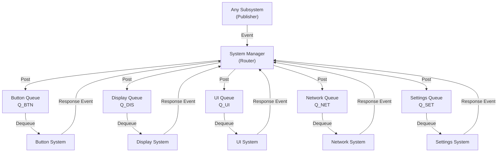
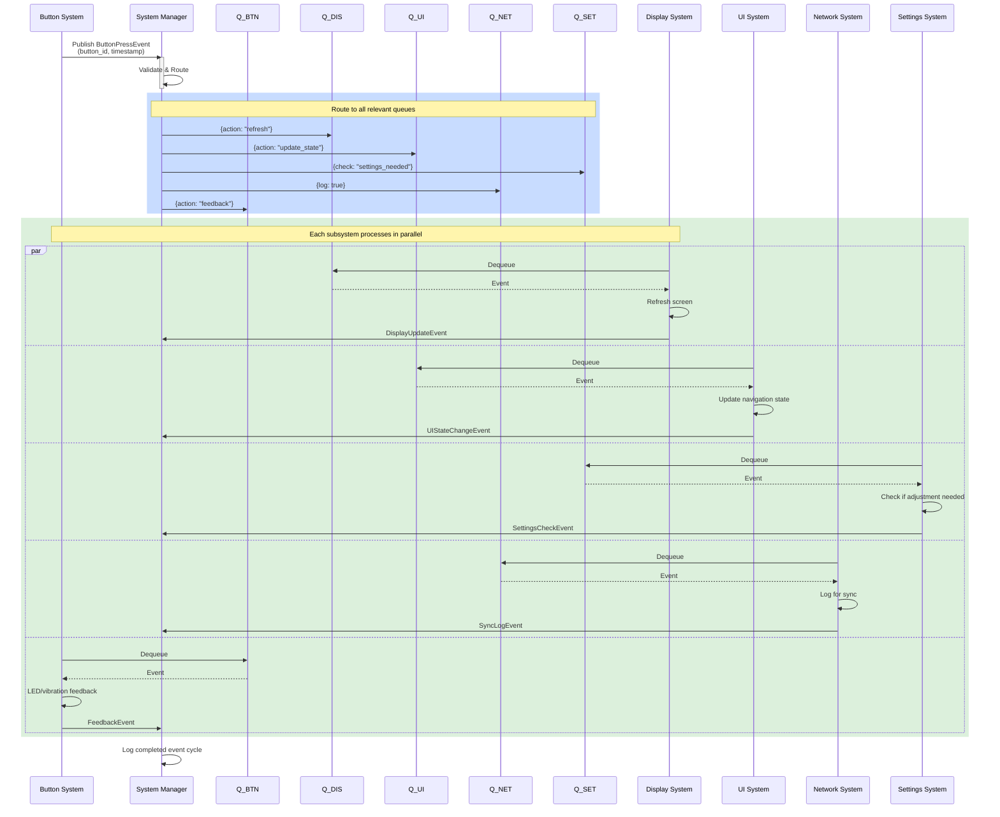

# System Manager — Detailed Design Document

## 1. Overview

The System Manager is the central coordinator of the NeoWatch firmware. It routes all inter-subsystem communication through dedicated message queues so that no subsystem calls another directly. This decoupled, event-driven design gives three key advantages:

- **Loose coupling** — subsystems only know about events, not each other's internals.
- **Async processing** — each subsystem drains its own queue at its own pace; nothing blocks.
- **Independent testability** — any subsystem can be tested with a mock queue.

### Subsystems

| Subsystem | Responsibility |
|-----------|---------------|
| **Button** | Detects physical input, provides haptic/LED feedback |
| **Display** | Renders content on screen, manages brightness and sleep |
| **UI** | Manages screen navigation, widget state, themes |
| **Network** | BLE communication, data sync with the companion app |
| **Settings** | Persists and validates user preferences |

---

## 2. Architecture

### How It Works

1. A subsystem (e.g. Button) **publishes** an event to the System Manager.
2. The System Manager **validates** the event and **routes** it to the relevant queue(s).
3. Each target subsystem **dequeues** and **processes** the event independently.
4. After processing, a subsystem may **publish a response event** back through the System Manager (e.g. `DisplayUpdateEvent`).



---

## 3. Event Types

Events are grouped into three categories:

| Category | Events |
|----------|--------|
| **UI** | Button press, touch input, display interaction, settings update |
| **Network** | Data received, connection status change, sync request, error |
| **System** | Power state change, mode change, configuration update, health check |

Each event carries a payload with the data needed for processing (e.g. `button_id`, `timestamp`, action parameters).

---

## 4. Queue Configuration

Every subsystem owns a dedicated FIFO queue. The table below summarises their roles:

| Queue | ID | Depth | Priority | Inbound Event Examples |
|-------|----|-------|----------|----------------------|
| **Button** | `Q_BTN` | 32 | High | LED control, vibration feedback, recalibration |
| **Display** | `Q_DIS` | 32 | High | Refresh, brightness change, sleep/wake |
| **UI** | `Q_UI` | 64 | Medium-High | Screen navigation, widget update, theme change |
| **Network** | `Q_NET` | 32 | Medium | Connect/disconnect, data TX, sync schedule |
| **Settings** | `Q_SET` | 32 | Medium-Low | Value change, config update, validation request |

> Queue depths are initial recommendations and can be tuned via `menuconfig` or compile-time constants.

---

## 5. Event Flow — Detailed Example

### 5.1 Button Press

The sequence below shows exactly what happens when a user presses a button:



### 5.2 Settings Change

A simpler flow showing how a settings change cascades:

```
1. User changes a setting (via UI)
   → System Manager publishes SettingsChangeEvent to Q_SET

2. Settings System dequeues the event
   → Validates the new value
   → Persists to storage
   → Publishes SettingsAppliedEvent back to System Manager

3. System Manager routes the confirmation
   → Q_DIS  — display refreshes to show new value
   → Q_UI   — UI updates any affected widgets
   → Q_NET  — syncs the change to companion app (if connected)
```

---

## 6. Queue Management

### Per-Queue Rules

| Rule | Description |
|------|-------------|
| **FIFO ordering** | Events are processed in the order they arrive |
| **Timeout** | Unprocessed events are discarded and logged after a configurable timeout |
| **Overflow** | When a queue is full, the oldest event is dropped (or the new event is rejected, depending on priority) and an alert is raised |
| **Acknowledgment** | After processing, the subsystem publishes an ACK (success) or NACK (failure) event |
| **Logging** | Every enqueue/dequeue operation is recorded for debugging |

### Cross-Queue Coordination

- The System Manager can **query any queue's depth** to detect backpressure.
- **Urgent events** (e.g. low battery) can be promoted across all queues.
- A simple **deadlock watchdog** monitors for queues that stop draining.

---

## 7. Design Considerations

| Concern | Mitigation |
|---------|-----------|
| Memory overflow | Bounded queue depths; overflow policy per queue |
| Stale events | Timeout mechanism discards events older than threshold |
| Failed processing | NACK event triggers retry or escalation |
| High-frequency events | Debounce at the publisher; coalesce duplicate events in the queue |
| Debugging | Full event log with timestamps; events can be replayed offline |
